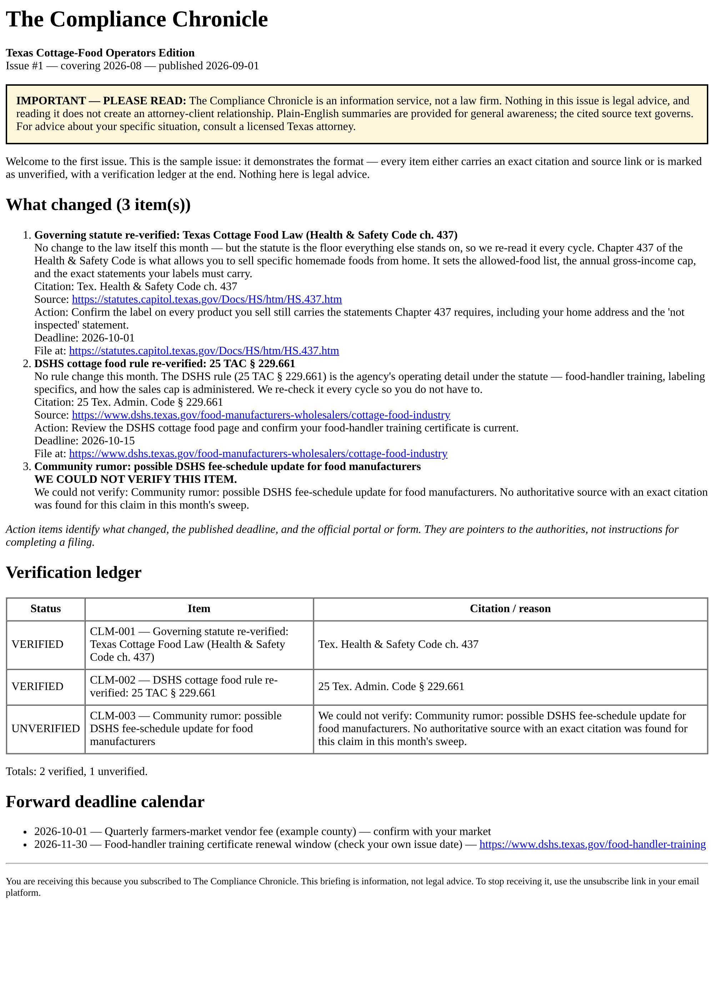
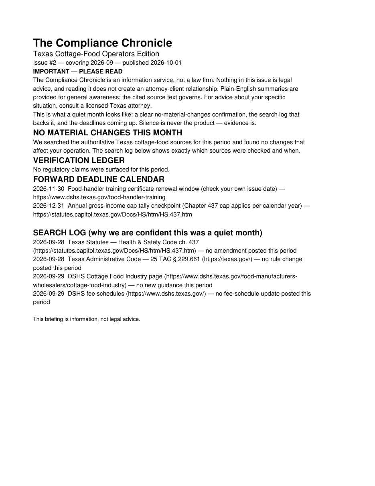

<div align="center">


**A monthly regulatory briefing for Texas cottage-food operators, where every claim is either cited or marked unverified.**

Each issue says what changed, what you must do and by when, in under ten minutes of reading. This repository is the production tooling behind it. The tooling assembles each issue, enforces the product's promises as executable publish gates, renders the email, and keeps a PDF archive you can search.


-555)




</div>

---

## The promise, as code

A newsletter that says "verified" has to mean it. This tooling turns each promise into a gate, and an issue that fails a hard gate **does not ship**:

| Gate | What it enforces |
|---|---|
| `model-validation` | every item carries an exact citation *and* a source link, or an explicit "we could not verify X". Every action item has its deadline and the official portal or form |
| `read-time` | an issue that takes more than 10 minutes to read fails |
| `lead-time` | an issue arriving on or after the earliest deadline it reports fails. Short lead time warns |
| `quiet-search-log` | a "no changes" month must include a complete, auditable log of the sources searched |
| `quiet-calendar` | a quiet month must still carry the forward deadline calendar |
| `verification-majority` | an issue that's mostly unverifiable has to say so up front |

Sources are ranked by authority (statute, then administrative rule, then agency guidance, then everything else), and conflicts are resolved in that order. The assembler **never drops a claim**. A claim that can't be cited becomes a visible *unverified* entry in the ledger.

## A quiet month is still an issue

When nothing changes, subscribers get proof of that: a no-material-changes confirmation, the dated search log behind it, and the deadlines coming up. The tooling's own line for it: *"Silence is never the product — evidence is."*

<div align="center">

<br><sub>A page from the archive PDF. Its text can be selected, and it was written by a dependency-free PDF writer in this repository.</sub>
</div>

## The monthly loop

```sh
# 1. Run the month's research sweep and save it as report.json
#    (schema: compliance_chronicle.research-report/v1, documented in assemble.py)
# 2. Curate it into curation.json
python3 -m compliance_chronicle assemble --report report.json --curation curation.json --out issue-003.json
python3 -m compliance_chronicle validate issue-003.json            # prints every gate, then SHIPPABLE or not
python3 -m compliance_chronicle render-email issue-003.json --out-dir out/
python3 -m compliance_chronicle archive --issues issue-*.json --out-dir archive/
```

To try it now, use the inputs in [`samples/`](samples/): a normal month and a quiet month. Both were run end to end while preparing this repository, and both passed every gate. The assembled Issue #1 came out byte-for-byte identical to the committed [`sample_issue/`](sample_issue/).

Billing runs on a third-party newsletter platform ($29/month; see [`docs/SUBSCRIPTION_SETUP.md`](docs/SUBSCRIPTION_SETUP.md)), and no custom payment code exists by design. The curation method and the publishing cadence are in [`docs/`](docs/).

## Tests

```bash
python3 -m pytest        # 114 passed, no third-party packages needed
```

## Honest notes

- **The research report is this repository's own JSON schema.** A Sneferu research run produces a report in prose, and no adapter is included to convert it. Today that conversion is part of the operator's curation step.
- **The sample issues are demonstration data**, labeled as such. Before relying on any citation, check it against the current Texas statutes and 25 TAC.
- *This briefing is information, not legal advice.* The disclaimer is printed on every issue by design.

## How it was made

**Sneferu's business pipeline** built The Compliance Chronicle as run `2026-08-11T01-43-00Z-pipeline-075cb355`. The run went through market grounding for Texas cottage-food operators, the economics of a $29/month newsletter, a product contract whose *falsification criteria* became the publish gates above, and a cooperative build between independent coder and reviewer models.

The brief kept in `problem_statement.md` is the run's original seed, which is about teaching children life skills. The business line's search for a bootstrap-feasible opportunity ended up far from that seed. A later run on the same seed stayed on it and produced *Life Skills Foundations*.

**Runtime link to Sneferu:** content only. Each issue starts from a monthly Sneferu Research run (see the report-schema note above), and the app itself never calls Sneferu.

<div align="center">

---

**Built by [Sneferu](https://sneferu.ai)**

<sub>README by Claude (Anthropic). Not legal advice.</sub>

</div>
